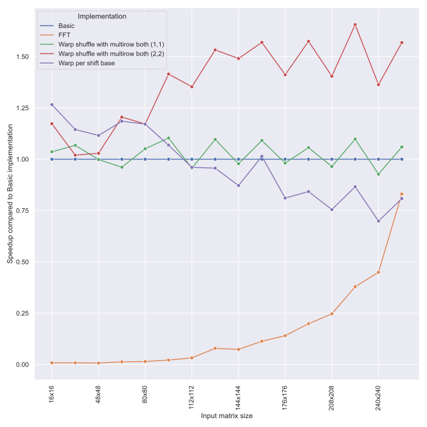

# Accelerating cross-correlation with GPUs

This repository contains the code accompanying the Master thesis "Accelerating cross-correlation with GPUs". It includes the CUDA C++ implementation of cross-correlation using both definition-based and FFT-based approach, together with the tools for benchmarking and validation of these implementations.


## Repository structure

The top level directories:

- [src](./src/) - The CUDA C++ program implementing cross-correlation using definition-based and FFT-based algorithms together with result validation.
- [benchmarking](./benchmarking/) - Python tool for benchmarking and validation of the CUDA C++ program and its cross-correlation implementations against each other or against real-world cross-correlation implementations in SciPy and Matlab.
- [existing](./existing/) -  Cross-correlation implementations used in the real-world. This repository utilizes them for result validation and comparison against our CUDA C++ implementations.
- [visualization](./visualization/) - Jupyter notebooks providing visualization of the results measured by the benchmarking tool. Includes all diagrams used in the text of the thesis and much more.
- [gpulab](./gpulab/) - Scripts for building, measuring and validating the CUDA C++ program on KSI Cluster gpulab. Also usable locally. Must be executed with the gpulab directory as working directory.
- [profiling](./profiling/) - Results of profiling the CUDA C++ implementation using Nsight Compute profiler.
- [sample_app](./sample_app/) - Sample application utilizing one of the cross-correlation implementations provided by this thesis.

### Algorithms implemented by the thesis

| Algorithm and optimizations | Source file | Kernel name |
| --------------------------- | ----------- | ----------- |
| Basic | [src/naive_original.cu](./src/naive_original.cu) | `cross_corr_naive_original` |
| Warp shuffle base | [src/naive_shuffle.cu](./src/naive_shuffle.cu) | `ccn_shuffle`|
| Warp shuffle base with work distribution | [src/naive_shuffle.cu](./src/naive_shuffle.cu) | `ccn_shuffle_work_distribution` |
| Warp shuffle with multimat_right | [src/naive_shuffle_multimat_right.cu](./src/naive_shuffle_multimat_right.cu) | `ccn_shuffle_multimat_right` |
| Warp shuffle with multimat_right and work distribution | [src/naive_shuffle_multimat_right.cu](./src/naive_shuffle_multimat_right.cu) | `ccn_shuffle_multimat_right_work_distribution` |
| Warp shuffle with multimat_both and work distribution| [src/naive_shuffle_n_to_m_multimat_both.cu](./src/naive_shuffle_n_to_m_multimat_both.cu) | `ccn_shuffle_n_to_m_multimat_both_work_distribution` |
| Warp shuffle with multirow_right | [src/naive_shuffle_multirow_right.cu](./src/naive_shuffle_multirow_right.cu) | `ccn_shuffle_multirow_right` |
| Warp shuffle with multirow_both | [src/naive_shuffle_multirow_both.cu](./src/naive_shuffle_multirow_both.cu) | `ccn_shuffle_multirow_both` |
| Warp shuffle with multirow_right and multimat_right | [src/naive_shuffle_multirow_right_multimat_right.cu](./src/naive_shuffle_multirow_right_multimat_right.cu) | `ccn_shuffle_multirow_right_multimat_right` |
| Warp shuffle with multirow_both and multimat_right | [src/naive_shuffle_one_to_many_multirow_both_multimat_right.cu](./src/naive_shuffle_one_to_many_multirow_both_multimat_right.cu) | `ccn_shuffle_one_to_many_multirow_both_multimat_right` |
| Warp shuffle with multirow_both and multimat_both | [src/naive_shuffle_n_to_m_multirow_both_multimat_both.cu](./src/naive_shuffle_n_to_m_multirow_both_multimat_both.cu) | `ccn_n_to_m_shuffle_multirow_both_multimat_both` |
| Warp per shift base | [src/naive_warp_per_shift.cu](./src/naive_warp_per_shift.cu) | `ccn_warp_per_shift` |
| Warp per shift with simple indexing | [src/naive_warp_per_shift.cu](./src/naive_warp_per_shift.cu) | `ccn_warp_per_shift_simple_indexing` |
| Warp per shift with work distribution | [src/naive_warp_per_shift.cu](./src/naive_warp_per_shift.cu) | `ccn_warp_per_shift_work_distribution` |
| Warp per shift with shared memory | [src/naive_warp_per_shift_shared_mem.cu](./src/naive_warp_per_shift_shared_mem.cu) | `ccn_warp_per_shift_shared_mem` |

To use these kernels for implementation of different input types and to implement time measurements, each kernel is wrapped by one class for each input type it is used for. This class handles algorithm arguments, time measurement, data loading, allocation, transfer, kernel execution, transfer back, result store, deallocation. These classes can be found in the files [src/one_to_one.hpp](./src/one_to_one.hpp), [src/one_to_many.hpp](./src/one_to_many.hpp), [src/n_to_mn.hpp](./src/n_to_mn.hpp), and[src/n_to_m.hpp](./src/n_to_m.hpp), based on the onput type they implement.

## Building the C++ CUDA implementations

The CUDA C++ program has following dependencies:
- CMake 3.18 or newer,
- CUDA 11.4 or newer,
- (Optional) Boost 1.71 or newer,
- (Optional) nlohmann/json 3.7.3 or newer

Optional dependencies can either be provided externally or downloaded automatically using a CMake superbuild.

To build the program using externally provided optional dependencies, follow these steps:
```bash
$ cd <repository_root>
$ mkdir build && cd build
$ cmake -D CMAKE_BUILD_TYPE:STRING=Release ..
$ cmake --build . --parallel --config Release
```
The build was tested on Ubuntu 20.04 and Rocky Linux 8.5. With the default configuration provided in the CMakeLists.txt file, the build may take over 8 hours due to the number of generated kernels and other function instantiations. You can use `cmake-gui` or the `-D` option to the `cmake ..` command to change the algorithm options, reducing compile times but limiting the available argument values accepted by the given algorithm argument.

To build the program without externally provided optional dependencies, run the following commands:
```
$ cd <repository_root>/gpulab
$ bash build.sh
```

To build the program on the KSI Cluster gpulab, run the following commands:
```
$ cd <repository_root>/gpulab
$ sbatch build.sh
```
To change any of the algorithm options, add the `-D` option with the correct value to the command on line 18 in the [gpulab/build.sh](./gpulab/build.sh) file.

All builds described above will create `cross` executable in the `build` directory.

### Algorithm options

Following is the full list of provided algorithm options with their default values for Release/Debug build. The structure of the option name is `<algorithm_name>_<option_name>`.
| Option name | Release value | Debug value |
|-------------|---------------|-------------|
| SHUFFLE_MULTIMAT_RIGHT_RIGHT_MATRICES_PER_THREAD_LIMIT | 8 | 4 |
| SHUFFLE_MULTIROW_RIGHT_RIGHT_ROWS_LIMIT | 8 | 4 |
| SHUFFLE_MULTIROW_BOTH_SHIFTS_PER_THREAD_LIMIT | 8 | 4 |
| SHUFFLE_MULTIROW_BOTH_LEFT_ROWS_LIMIT | 4 | 2 |
| SHUFFLE_MULTIROW_BOTH_LOCAL_MEM_SHIFTS_PER_THREAD_LIMIT | 4 | 2 |
| SHUFFLE_MULTIROW_BOTH_LOCAL_MEM_LEFT_ROWS_LIMIT | 4 | 2 |
| SHUFFLE_MULTIROW_RIGHT_MULTIMAT_RIGHT_RIGHT_ROWS_LIMIT | 4 | 2 |
| SHUFFLE_MULTIROW_RIGHT_MULTIMAT_RIGHT_RIGHT_MATS_LIMIT | 4 | 2 |
| SHUFFLE_N_TO_M_MULTIMAT_BOTH_LEFT_MATRICES_PER_THREAD_LIMIT | 4 | 2 |
| SHUFFLE_N_TO_M_MULTIMAT_BOTH_RIGHT_MATRICES_PER_THREAD_LIMIT | 4 | 2 |
| SHUFFLE_N_TO_M_MULTIMAT_BOTH_LOCAL_MEM_LEFT_MATRICES_PER_THREAD_LIMIT | 4 | 2 |
| SHUFFLE_N_TO_M_MULTIMAT_BOTH_LOCAL_MEM_RIGHT_MATRICES_PER_THREAD_LIMIT | 4 | 2 |
| SHUFFLE_N_TO_M_MULTIROW_BOTH_MULTIMAT_BOTH_SHIFTS_PER_THREAD_PER_RIGHT_MATRIX_LIMIT | 4 | 2 |
| SHUFFLE_N_TO_M_MULTIROW_BOTH_MULTIMAT_BOTH_RIGHT_MATRICES_PER_THREAD_LIMIT | 4 | 2 |
| SHUFFLE_N_TO_M_MULTIROW_BOTH_MULTIMAT_BOTH_LEFT_MATRICES_PER_THREAD_LIMIT | 4 | 2 |
| SHUFFLE_N_TO_M_MULTIROW_BOTH_MULTIMAT_BOTH_LEFT_ROWS_PER_ITERATION_LIMIT | 4 | 2 |
| SHUFFLE_ONE_TO_MANY_MULTIROW_BOTH_MULTIMAT_RIGHT_SHIFTS_PER_RIGHT_MATRIX_LIMIT | 4 | 2 |
| SHUFFLE_ONE_TO_MANY_MULTIROW_BOTH_MULTIMAT_RIGHT_RIGHT_MATRICES_PER_THREAD_LIMIT | 4 | 2 |
| SHUFFLE_ONE_TO_MANY_MULTIROW_BOTH_MULTIMAT_RIGHT_LEFT_ROWS_PER_ITERATION_LIMIT | 4 | 2 |
| WARP_PER_SHIFT_SHARED_MEM_RIGHT_MATRICES_PER_BLOCK_LIMIT | 8 | 2 |

The default build is mainly limited by the `SHUFFLE_N_TO_M_MULTIROW_BOTH_MULTIMAT_BOTH` and `SHUFFLE_ONE_TO_MANY_MULTIROW_BOTH_MULTIMAT_RIGHT`. Reducing values for options of these two algorithms will improve the compilation time. The number of generated functions is approximately equal to the values of the options for the given algorithm multiplied together. As these two algorithms both have 4 options, they generate the most functions and take the longest time to compile.

## Running the C++ CUDA implementations

The C++ CUDA program provides a CLI application implementing several commands for running cross-correlation computation, measuring execution times of this computation and its parts or validating results.

Small dataset is included in this repository in the `data` directory. When using the benchmarking tool described following section, random input data (and optionally validation data for this input) is generated by the tool itself.

### Examples

List available algorithms:
```
$ ./build/cross list
```

Compute cross-correlation of two matrices using the Warp shuffle algorithm:
```
$ ./build/cross run -o output.csv nai_shuffle_one_to_one ./data/ina_256_256_1_1.csv ./data/ina_256_256_1_2.csv
```

Run computation and validate the results:
```
$ ./build/cross run -v ./data/valid_n_to_mn_256_256_4_16_1_1.csv nai_shuffle_multirow_both_multimat_right_n_to_mn ./data/ina_256_256_4_1.csv ./data/ina_256_256_16_1.csv
```
Run Warp shuffle base implementation and measure the kernel runtime 5 times, each time adaptively increasing the number of kernel iterations measured until it runs at least 1 second, writing the results to the `kernel_measurement.csv` file. This also will not store the results, as we are not interested in those.

```
./build/cross run -b "Algorithm" -l 5 -m 1 -t "kernel_measurements.csv" "nai_shuffle_one_to_one" ./data/ina_256_256_1_1.csv ./data/ina_256_256_1_2.csv
```

### CLI commands and their options

- **help**: Prints help message describing the CLI interface.
- **run**: Runs a cross-correlation computation using the specified algorithm, optionally measuring execution times or validating output.
    - Positional arguments:
        1. `<alg>`: The algorithm to use for the computation.
        2. `<ref_path>`: Path to the left input matrix/matrices.
        3. `<target_path>`: Path to the right input matrix/matrices.
    - Options and switches
        - `-d|--data_type <"single"|"double">`: Data type to use for computation, choice between single and double floating point numbers, defaults to single.
        - `-o|--out <path>`: Path to the output file for the result of the computation. The result is only stored if this option is provided.
        - `-t|--times <path>`: Path to the file in which to store the measured execution times, defaults to `measurements.csv`.
        - `-v|--validate [path]`: Option with an optional value which either enables validation against valid results computed using simple CPU implementation, or additionally provides a path to valid results to use for comparison. Validation results are written to the standard output.
        - `-n|--normalize`: If results of FFT-based algorithm should be normalized before being written to the output file. Ignored if not writing output or if algorithm is not FFT-based.
        - `-a|--append`: Append times to the file instead of overwriting it. Also changes validation results format printed to the standard output.
		- `-p|--no_progress` Do not print computation progress to standard output.
		- `-b|--benchmark_type <"Compute"|"CommonSteps"|"Algorithm"|"None">`: Which part of the implementation should be measured, defaults to `"None"`.
		- `-l|--outer_loops`: Number of times the algorithm should be run after loading the data into memory. Each run is measured separately.
		- `-m|--min_time`: Minimum measurement time for measurements with adaptive iteration count, defaults to 1 second.
		- `--args_path`: Path to the JSON file containing argument values for the algorithm.
- **list**: Lists the available algorithms. Each of the listed names can be used as `alg` positional argument of the **run** command.
- **validate**: Compares two result files, executing the same validation as done by the **run** command with the `-v` option.
    - Positional arguments:
        1. `<template_data_path>`: The path to the known correct output to compare against.
        2. `<validate_data_path>`: The path to the data to be validated.
    - Options and switches:
        - `-n|--normalize`: Normalize validated data. This option is useful when results of FFT-based algorithm were stored without normalization.
        - `-c|--csv`: Print output in CSV format instead of in human readable format.
        - `-p|--print_header`: Print header before the output data. Useful when not appending to existing file.
- **input**: Validate that the given input matrices can be computed by given algorithm.
    - Positional arguments:
        1. `<alg_type>`: The algorithm to validate for.
        2. `<rows>`: The number of rows of each input matrix.
        3. `<cols>`: The number of columns of each input matrix.
        4. `<left_matrices>`: The number of left input matrices.
        5. `<right_matrices>`: The number of right input matrices.

### Provided dataset

The dataset is mainly provided to allow fast testing when implementing the cross-correlation algorithms. It is not ment for benchmarking or comprehensive validation of the implementation, for which the benchmarking tool is provided.

The benchmarking tool can also generated input files and validation files. All tools in this repository read and write files with the format described in this section.

The data files follow a simple naming scheme, where the name is made up of the following parts separated by underscores:
- **ina**, short for **in**put **a**rray of matrices.
- Number of rows in each matrix, i.e. the size of the *y* axis.
- Number of columns in each matrix, i.e. the size of the *x* axis.
- Number of matrices in the file.
- Sequential ID for files with the same number of matrices of the same size.

The files are simple CSV files which on their first line contain a CSV comment with 3 numbers:
1. Number of rows in each matrix.
2. Number of columns in each matrix.
3. Number of matrices in the file.

Each matrix is stored in row major order, one row per line, with rows of all matrices concatenated into one big csv table.

Another data contained in the directory are validation files, which are precomputed results of the input matrices. The name is made up the following parts separated by underscores:

- **valid**, identifying validation file.
- Computation type, one of `one_to_one`, `one_to_many`, `n_to_mn`, `n_to_m`.
- Identification of the input files, made up of:
    1. The number of input matrix rows.
    2. The number of input matrix columns.
    3. Number of matrices in the left input file.
    4. Number of matrices in the right input file.
    5. Sequential ID of the left input file.
    6. Sequential ID of the right input file.

Again it is a csv file with the same format as the input files.


## Using the benchmarking tool

The benchmarking tool is a Python CLI application designed to simplify running large number of benchmarks or validations using the `cross` executable or any of the existing cross-correlation implementations. In the current version of this repository, the available implementations are SciPy and Matlab.

The tool has the following commands:
- **benchmark**: Run benchmarks using yaml definition files.
- **list**: List available algorithms implemented by the `cross` executable.
- **generate**: Generating input data such as those in [data](./data/) directory.
- **validation**: Use Matlab or SciPy to generate valid results from given inputs, use `cross` executable to compute the result error comperd to precomputed valid result, or check that statistics computed by validation benchmark are within tolerance.
- **transform**: Copy subset of matrices from the csv file.
- **clear**: Clear benchmark results.

### Dependencies
The tool is designed to install all dependencies (except matlab) using **poetry**.

- poetry 1.1.0 or newer
- (optional) matlab R2021a or newer

When benchmarking against matlab or using matlab as the source of validation data (which is the default behavior), matlab needs to be available on the PATH.

### Example benchmarks

First, build the CUDA C++ executable with the following commands:
```
$ mkdir example_bench_build && cd example_bench_build
$ cmake -D CMAKE_BUILD_TYPE:STRING=Release -D SHUFFLE_MULTIMAT_RIGHT_RIGHT_MATRICES_PER_THREAD_LIMIT=1 -D SHUFFLE_MULTIROW_RIGHT_RIGHT_ROWS_LIMIT=1 -D SHUFFLE_MULTIROW_BOTH_SHIFTS_PER_THREAD_LIMIT=2 -D SHUFFLE_MULTIROW_BOTH_LEFT_ROWS_LIMIT=2 -D SHUFFLE_MULTIROW_BOTH_LOCAL_MEM_SHIFTS_PER_THREAD_LIMIT=1 -D SHUFFLE_MULTIROW_BOTH_LOCAL_MEM_LEFT_ROWS_LIMIT=1 -D SHUFFLE_MULTIROW_RIGHT_MULTIMAT_RIGHT_RIGHT_ROWS_LIMIT=1 -D SHUFFLE_MULTIROW_RIGHT_MULTIMAT_RIGHT_RIGHT_MATS_LIMIT=1 -D SHUFFLE_N_TO_M_MULTIMAT_BOTH_LEFT_MATRICES_PER_THREAD_LIMIT=1 -D SHUFFLE_N_TO_M_MULTIMAT_BOTH_RIGHT_MATRICES_PER_THREAD_LIMIT=1 -D SHUFFLE_N_TO_M_MULTIMAT_BOTH_LOCAL_MEM_LEFT_MATRICES_PER_THREAD_LIMIT=1 -D SHUFFLE_N_TO_M_MULTIMAT_BOTH_LOCAL_MEM_RIGHT_MATRICES_PER_THREAD_LIMIT=1 -D SHUFFLE_N_TO_M_MULTIROW_BOTH_MULTIMAT_BOTH_SHIFTS_PER_THREAD_PER_RIGHT_MATRIX_LIMIT=1 -D SHUFFLE_N_TO_M_MULTIROW_BOTH_MULTIMAT_BOTH_RIGHT_MATRICES_PER_THREAD_LIMIT=1 -D SHUFFLE_N_TO_M_MULTIROW_BOTH_MULTIMAT_BOTH_LEFT_MATRICES_PER_THREAD_LIMIT=1 -D SHUFFLE_N_TO_M_MULTIROW_BOTH_MULTIMAT_BOTH_LEFT_ROWS_PER_ITERATION_LIMIT=1 -D SHUFFLE_ONE_TO_MANY_MULTIROW_BOTH_MULTIMAT_RIGHT_SHIFTS_PER_RIGHT_MATRIX_LIMIT=1 -D SHUFFLE_ONE_TO_MANY_MULTIROW_BOTH_MULTIMAT_RIGHT_RIGHT_MATRICES_PER_THREAD_LIMIT=1 -D SHUFFLE_ONE_TO_MANY_MULTIROW_BOTH_MULTIMAT_RIGHT_LEFT_ROWS_PER_ITERATION_LIMIT=1 -D WARP_PER_SHIFT_SHARED_MEM_RIGHT_MATRICES_PER_BLOCK_LIMIT=1 ..
$ cmake --build . --config Release --parallel
```

These commands minimize compile time by limiting the arguments for all algorithms which are not used by the example benchmark. The build should take less than 5 minutes.

Next we run the `one_to_one` group of the [benchmarking/example/benchmark.yml](./benchmarking/example/benchmark.yml) benchmark, which benchmarks several chosen implementations of the `one-to-one` type utilizing GPU provided by CUDA C++. The results are stored in the same directory as the benchmark definition, in the directory named `results`. The benchmarks should run for around 64 minutes. If you want to reduce the time of the benchmarking, reduce the number of inner or outer iterations, set lower min_measure time or reduce the number of inputs by deleting them from the yaml definition.

From the [./benchmarking](./benchmarking/) directory, run:
```
poetry run ./benchmarking.py -e "../example_bench_build/cross" benchmark -o results ./example/benchmark.yml one_to_one
```

To visualize the results, open the [visualization/example_benchmark.ipynb](./visualization/example_benchmark.ipynb) and run it. The results should look similar to the following graph:



### Running benchmarks

The entry point for the benchmarking tool is the [./benchmarking/](./benchmarking/) script, which has to be run from a poetry virtual environment. To run a benchmark, execute the following command from within the poetry virtual environment:
```
./benchmarking.py benchmark <path_to_definition> [group]...
```

The benchmark definition file is a yaml file which describes one or more groups of benchmarks. Runs in a group share input sizes, data type, which part of the algorithm is measured, number of iterations, if validation is executed and if output data is kept.

Each run defines a user friendly name, algorithm to run (from the list provided by `./cross list`), and settings for algorithm arguments. Each algorithm argument can be specified as array of values. Then the run is repeated for all combinations of all argument values.

See [benchmarking/example/benchmark.yml](benchmarking/example/benchmark.yml) for an example of benchmark definition.

For the benchmark command itself, the most useful options are `-r|--rerun` and `-c|--continue`. By default, the tool refuses to execute benchmark if any results for given group already exist. With `-r`, the existing results are deleted. With `-c`, the existing measurements are skipped.

## Using the implementations in your program

As this thesis is mainly aimed at comparing different implementations by profiling and benchmarking, it is not designed to provide easy use of the cross-correlation implementations in external programs.

Sample application using one of the implementations is provided in the [sample_app](./sample_app) directory.
Dependencies of any application using the cross-correlation implementation:
- CUDA 11.4 or newer

Sample app specific dependencies:
- CMake 3.18 or newer
- Boost 1.71 or newer

Pick one of the algorithms from the [list of algorithms above](#Algorithms-implemented-by-the-thesis).
Copy the listed .cu file. For sample application, we choose the `Warp shuffle with multirow_both and multimat_right`, copying the [src/naive_shuffle_one_to_many_multirow_both_multimat_right.cu](./src/naive_shuffle_one_to_many_multirow_both_multimat_right.cu) file.

Next copy the prototype of the kernel run function from the file [src/kernels.cuh](./src/kernels.cuh), in the case of Sample app the `run_ccn_shuffle_one_to_many_multirow_both_multimat_right` function declaration.

You will also need several header and cpp files listed below.

The following header files need to be copied:
- [src/types.cuh](./src/types.cuh)
- [src/cuda_helpers.cuh](./src/cuda_helpers.cuh)
- [src/bound_checked_loads.cuh](./src/bound_checked_loads.cuh)
- [src/row_distribution.cuh](./src/row_distribution.cuh)
- [src/warp_size.hpp](./src/warp_size.hpp)
- [src/kernel_args.hpp](./src/kernel_args.hpp)
- [src/shared_mem.cuh](./src/shared_mem.cuh)

The following cpp files need to be copied:
- [src/row_distribution.cpp](./src/row_distribution.cpp)
- [src/kernel_args.cpp](./src/kernel_args.cpp)

To allow the sample application to parse csv files, we also require the Boost library and the following headers:
- [src/matrix.hpp](./src/matrix.hpp)
- [src/host_helpers.hpp](./src/host_helpers.hpp)

During compilation, you will need to define values for the options defined for your chosen implementation, as listed in the [Algorithm options](#Algorithm-options) section.
In the sample application, this is achieved using CMake for the following variables and values:

| Option name | Value |
|-------------|-------|
| SHUFFLE_ONE_TO_MANY_MULTIROW_BOTH_MULTIMAT_RIGHT_SHIFTS_PER_RIGHT_MATRIX_LIMIT | 2 |
| SHUFFLE_ONE_TO_MANY_MULTIROW_BOTH_MULTIMAT_RIGHT_RIGHT_MATRICES_PER_THREAD_LIMIT | 2 |
| SHUFFLE_ONE_TO_MANY_MULTIROW_BOTH_MULTIMAT_RIGHT_LEFT_ROWS_PER_ITERATION_LIMIT | 2 |

The sample application is compiled using the following commands:
```
cd sample_app
mkdir build && cd build
cmake -D CMAKE_BUILD_TYPE:STRING=Release ..
cmake --build . --config Release
```

The executable `sample_app` can then be used to compute *one-to-many* cross-correlation such as this:
```
./sample_app/build/sample_app ./data/ina_256_256_1_1.csv ./data/ina_256_256_16_1.csv > ./results.csv
```

The results can be validated using:
```
./build/cross validate ./data/valid_one_to_many_256_256_1_16_1_1.csv ./results.csv
```

## Recreating the results shown in the text of the thesis

The following benchmarks are used by the Jupyter notebook [text_diagrams.ipynb](./visualization/text_diagrams.ipynb) generating diagrams for the thesis text:
- [block_per_shift.yml](./benchmarking/text/block_per_shift.yml)
- [fft.yml](./benchmarking/text/fft.yml)
- [fft_small.yml](./benchmarking/text/fft_small.yml)
- [warp_shuffle_optimizations_speedup.yml](./benchmarking/text/warp_shuffle_optimizations_speedup.yml)
- [warp_per_shift_optimizations_speedup.yml](./benchmarking/text/warp_per_shift_optimizations_speedup.yml)
- [fft_speedup_compute_resolution.yml](./benchmarking/text/fft_speedup_compute_resolution.yml)
- [fft_speedup_compute_resolution2.yml](./benchmarking/text/fft_speedup_compute_resolution2.yml)
- [fft_speedup_compute_startup_resolution.yml](./benchmarking/text/fft_speedup_compute_startup_resolution.yml)
- [scipy_speedup.yml](./benchmarking/text/scipy_speedup.yml)

All produce results in a directory with the same name as the definition file without the `.yml` suffix. Apart from the matlab benchmark, all were run on both gpulab and notebook. Results of gpulab runs were copied to [benchmarking/text](./benchmarking/text/) directory with the suffix `_gpulab` added to them. The total time required to run all the benchmarks is several weeks.

As attached to the thesis and commited to git, the results are compressed into a `.tar.gz` archive in the [benchmarking/text](./benchmarking/text/). Extracting the archive should allow you to generate the diagrams yourself.
